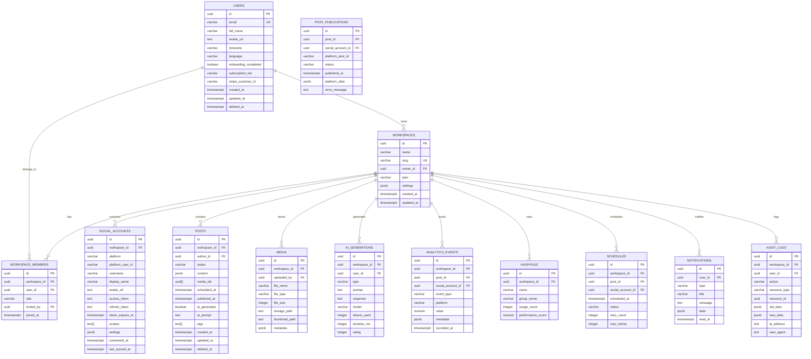

# Phase 4: Database Prompts

## 4.1 Generate PostgreSQL Schema (All Tables)

**Phase:** 4-Database
**Output:** `supabase/migrations/` SQL files
**Inputs:** TRD, data requirements

```
Generate complete PostgreSQL schema for Social Media AI with all tables.

## Migration Files to Generate

### 001_create_extensions.sql
```sql
CREATE EXTENSION IF NOT EXISTS "uuid-ossp";
CREATE EXTENSION IF NOT EXISTS "pgcrypto";
CREATE EXTENSION IF NOT EXISTS "pg_trgm";
```

### 002_create_users.sql
Generate users table with:
- id (UUID, PK)
- email (VARCHAR, UNIQUE)
- full_name (VARCHAR)
- avatar_url (TEXT)
- timezone (VARCHAR)
- language (VARCHAR)
- onboarding_completed (BOOLEAN)
- subscription_tier (VARCHAR)
- stripe_customer_id (VARCHAR)
- created_at, updated_at, deleted_at

### 003_create_workspaces.sql
Generate workspaces table with:
- id (UUID, PK)
- name (VARCHAR)
- slug (VARCHAR, UNIQUE)
- owner_id (UUID, FK users)
- plan (VARCHAR)
- settings (JSONB)
- created_at, updated_at

### 004_create_workspace_members.sql
Generate workspace_members with:
- id (UUID, PK)
- workspace_id (UUID, FK)
- user_id (UUID, FK)
- role (VARCHAR)
- invited_by (UUID, FK)
- joined_at

### 005_create_social_accounts.sql
Generate social_accounts with:
- id (UUID, PK)
- workspace_id (UUID, FK)
- platform (VARCHAR)
- platform_user_id (VARCHAR)
- username (VARCHAR)
- display_name (VARCHAR)
- avatar_url (TEXT)
- access_token (TEXT, encrypted)
- refresh_token (TEXT, encrypted)
- token_expires_at (TIMESTAMPTZ)
- scopes (TEXT[])
- settings (JSONB)
- connected_at, last_synced_at

### 006_create_posts.sql
Generate posts table with:
- id (UUID, PK)
- workspace_id (UUID, FK)
- author_id (UUID, FK users)
- status (VARCHAR: draft, scheduled, published, failed)
- content (JSONB)
- media_ids (UUID[])
- scheduled_at (TIMESTAMPTZ)
- published_at (TIMESTAMPTZ)
- ai_generated (BOOLEAN)
- ai_prompt (TEXT)
- tags (TEXT[])
- created_at, updated_at, deleted_at

### 007_create_post_publications.sql
Generate post_publications with:
- id (UUID, PK)
- post_id (UUID, FK)
- social_account_id (UUID, FK)
- platform_post_id (VARCHAR)
- status (VARCHAR)
- published_at (TIMESTAMPTZ)
- platform_data (JSONB)
- error_message (TEXT)

### 008_create_media.sql
Generate media table with:
- id (UUID, PK)
- workspace_id (UUID, FK)
- uploaded_by (UUID, FK)
- file_name (VARCHAR)
- file_type (VARCHAR)
- file_size (INTEGER)
- storage_path (TEXT)
- thumbnail_path (TEXT)
- metadata (JSONB)

### 009_create_ai_generations.sql
Generate ai_generations with:
- id (UUID, PK)
- workspace_id (UUID, FK)
- user_id (UUID, FK)
- type (VARCHAR)
- prompt (TEXT)
- response (TEXT)
- model (VARCHAR)
- tokens_used (INTEGER)
- duration_ms (INTEGER)
- rating (INTEGER)

### 010_create_analytics_events.sql
Generate analytics_events with:
- id (UUID, PK)
- workspace_id (UUID, FK)
- post_id (UUID, FK)
- social_account_id (UUID, FK)
- event_type (VARCHAR)
- platform (VARCHAR)
- value (NUMERIC)
- metadata (JSONB)
- recorded_at (TIMESTAMPTZ)

### 011_create_hashtags.sql
Generate hashtags with:
- id (UUID, PK)
- workspace_id (UUID, FK)
- name (VARCHAR)
- group_name (VARCHAR)
- usage_count (INTEGER)
- performance_score (NUMERIC)

### 012_create_schedules.sql
Generate schedules with:
- id (UUID, PK)
- workspace_id (UUID, FK)
- post_id (UUID, FK)
- social_account_id (UUID, FK)
- scheduled_at (TIMESTAMPTZ)
- status (VARCHAR)
- retry_count (INTEGER)
- max_retries (INTEGER)

### 013_create_notifications.sql
Generate notifications with:
- id (UUID, PK)
- user_id (UUID, FK)
- type (VARCHAR)
- title (VARCHAR)
- message (TEXT)
- data (JSONB)
- read_at (TIMESTAMPTZ)

### 014_create_audit_logs.sql
Generate audit_logs with:
- id (UUID, PK)
- workspace_id (UUID, FK)
- user_id (UUID, FK)
- action (VARCHAR)
- resource_type (VARCHAR)
- resource_id (UUID)
- old_data (JSONB)
- new_data (JSONB)
- ip_address (INET)
- user_agent (TEXT)

### 015_create_indexes.sql
Generate all indexes:
- Primary keys
- Foreign keys
- Search indexes
- Composite indexes
- Partial indexes

### 016_create_rls_policies.sql
Generate RLS policies for all tables:
- Workspace isolation
- Role-based access
- Resource ownership

### 017_create_functions.sql
Generate database functions:
- updated_at trigger
- Soft delete function
- Workspace membership check
- Role validation

### 018_create_triggers.sql
Generate triggers:
- updated_at auto-update
- Audit logging
- Validation

Generate complete SQL for all migrations with proper error handling.
```

**Expected Output:** 18 migration files with complete SQL schema, indexes, RLS, and triggers.

---

## 4.2 Generate RLS Policies

**Phase:** 4-Database
**Output:** `supabase/migrations/016_rls_policies.sql`
**Inputs:** Permission model, schema

```
Generate comprehensive Row-Level Security policies for Social Media AI.

## RLS Policy Structure

### Enable RLS
```sql
ALTER TABLE users ENABLE ROW LEVEL SECURITY;
ALTER TABLE workspaces ENABLE ROW LEVEL SECURITY;
ALTER TABLE workspace_members ENABLE ROW LEVEL SECURITY;
-- ... for all tables
```

### Policy Patterns

#### 1. Workspace Isolation
```sql
CREATE POLICY workspace_isolation ON posts
  FOR ALL
  USING (workspace_id = auth.workspace_id());
```

#### 2. Owner Only
```sql
CREATE POLICY owner_only ON workspaces
  FOR ALL
  USING (owner_id = auth.uid());
```

#### 3. Member Access
```sql
CREATE POLICY member_access ON posts
  FOR SELECT
  USING (
    workspace_id IN (
      SELECT workspace_id FROM workspace_members
      WHERE user_id = auth.uid()
    )
  );
```

#### 4. Role-Based Write
```sql
CREATE POLICY editor_can_insert ON posts
  FOR INSERT
  WITH CHECK (
    workspace_id IN (
      SELECT workspace_id FROM workspace_members
      WHERE user_id = auth.uid()
      AND role IN ('owner', 'admin', 'editor')
    )
  );
```

#### 5. Creator Access
```sql
CREATE POLICY creator_access ON posts
  FOR UPDATE
  USING (
    author_id = auth.uid()
    OR workspace_id IN (
      SELECT workspace_id FROM workspace_members
      WHERE user_id = auth.uid()
      AND role IN ('owner', 'admin')
    )
  );
```

## Policies to Generate

### users table
- Users can read own profile
- Users can update own profile
- Admins can read workspace members

### workspaces table
- Owners can manage workspace
- Members can read workspace
- Admins can update workspace

### workspace_members
- Owners/admins can manage members
- Members can read workspace members
- Users can read own membership

### posts
- Members can read workspace posts
- Editors can create posts
- Creators can update own posts
- Admins can delete any post

### social_accounts
- Members can read accounts
- Admins can manage accounts

### analytics_events
- Members can read workspace analytics
- System can insert analytics

### notifications
- Users can read own notifications
- Users can update own notifications

### audit_logs
- Admins can read audit logs
- System can insert audit logs

## Helper Functions
```sql
CREATE OR REPLACE FUNCTION auth.workspace_id()
RETURNS UUID AS $$
  SELECT workspace_id FROM workspace_members
  WHERE user_id = auth.uid()
  LIMIT 1;
$$ LANGUAGE sql SECURITY DEFINER;

CREATE OR REPLACE FUNCTION auth.has_role(required_role TEXT)
RETURNS BOOLEAN AS $$
  SELECT EXISTS (
    SELECT 1 FROM workspace_members
    WHERE user_id = auth.uid()
    AND role = required_role
  );
$$ LANGUAGE sql SECURITY DEFINER;
```

Generate complete RLS policies for all tables with helper functions.
```

**Expected Output:** 50+ RLS policies with helper functions and security patterns.

---

## 4.3 Generate Indexes

**Phase:** 4-Database
**Output:** `supabase/migrations/015_indexes.sql`
**Inputs:** Query patterns, performance requirements

```
Generate comprehensive database indexes for Social Media AI.

## Index Strategy

### Primary Key Indexes
Already created with tables (UUID).

### Foreign Key Indexes
```sql
-- users
CREATE INDEX idx_users_email ON users(email);
CREATE INDEX idx_users_stripe ON users(stripe_customer_id);

-- workspaces
CREATE INDEX idx_workspaces_owner ON workspaces(owner_id);
CREATE INDEX idx_workspaces_slug ON workspaces(slug);

-- workspace_members
CREATE INDEX idx_workspace_members_user ON workspace_members(user_id);
CREATE INDEX idx_workspace_members_workspace ON workspace_members(workspace_id);

-- social_accounts
CREATE INDEX idx_social_accounts_workspace ON social_accounts(workspace_id);
CREATE INDEX idx_social_accounts_platform ON social_accounts(platform, platform_user_id);

-- posts
CREATE INDEX idx_posts_workspace ON posts(workspace_id);
CREATE INDEX idx_posts_author ON posts(author_id);
CREATE INDEX idx_posts_status ON posts(status);
CREATE INDEX idx_posts_scheduled ON posts(scheduled_at) WHERE status = 'scheduled';
CREATE INDEX idx_posts_created ON posts(created_at DESC);

-- post_publications
CREATE INDEX idx_post_publications_post ON post_publications(post_id);
CREATE INDEX idx_post_publications_account ON post_publications(social_account_id);
CREATE INDEX idx_post_publications_status ON post_publications(status);

-- media
CREATE INDEX idx_media_workspace ON media(workspace_id);
CREATE INDEX idx_media_type ON media(file_type);

-- ai_generations
CREATE INDEX idx_ai_generations_workspace ON ai_generations(workspace_id);
CREATE INDEX idx_ai_generations_type ON ai_generations(type);
CREATE INDEX idx_ai_generations_created ON ai_generations(created_at DESC);

-- analytics_events
CREATE INDEX idx_analytics_post ON analytics_events(post_id);
CREATE INDEX idx_analytics_account ON analytics_events(social_account_id);
CREATE INDEX idx_analytics_workspace ON analytics_events(workspace_id);
CREATE INDEX idx_analytics_type ON analytics_events(event_type);
CREATE INDEX idx_analytics_recorded ON analytics_events(recorded_at DESC);

-- hashtags
CREATE INDEX idx_hashtags_workspace ON hashtags(workspace_id);
CREATE INDEX idx_hashtags_name ON hashtags(name);
CREATE INDEX idx_hashtags_group ON hashtags(workspace_id, group_name);

-- schedules
CREATE INDEX idx_schedules_pending ON schedules(scheduled_at) WHERE status = 'pending';
CREATE INDEX idx_schedules_workspace ON schedules(workspace_id);
CREATE INDEX idx_schedules_post ON schedules(post_id);

-- notifications
CREATE INDEX idx_notifications_user ON notifications(user_id);
CREATE INDEX idx_notifications_unread ON notifications(user_id, read_at) WHERE read_at IS NULL;

-- audit_logs
CREATE INDEX idx_audit_logs_workspace ON audit_logs(workspace_id);
CREATE INDEX idx_audit_logs_user ON audit_logs(user_id);
CREATE INDEX idx_audit_logs_action ON audit_logs(action);
CREATE INDEX idx_audit_logs_created ON audit_logs(created_at DESC);
```

### Search Indexes
```sql
-- Full-text search on posts
CREATE INDEX idx_posts_content_search ON posts
  USING GIN (to_tsvector('english', content->>'text'));

-- Trigram search on hashtags
CREATE INDEX idx_hashtags_name_trgm ON hashtags
  USING GIN (name gin_trgm_ops);
```

### Composite Indexes
```sql
-- Common query patterns
CREATE INDEX idx_posts_workspace_status ON posts(workspace_id, status);
CREATE INDEX idx_posts_workspace_scheduled ON posts(workspace_id, scheduled_at)
  WHERE status = 'scheduled';
CREATE INDEX idx_analytics_workspace_type ON analytics_events(workspace_id, event_type);
CREATE INDEX idx_analytics_workspace_recorded ON analytics_events(workspace_id, recorded_at DESC);
```

### Partial Indexes
```sql
-- Active schedules only
CREATE INDEX idx_schedules_active ON schedules(scheduled_at)
  WHERE status IN ('pending', 'retrying');

-- Unread notifications
CREATE INDEX idx_notifications_unread ON notifications(user_id)
  WHERE read_at IS NULL;
```

Generate complete index SQL with explanations for each index.
```

**Expected Output:** 60+ indexes with explanations and performance rationale.

---

## 4.4 Generate Migrations

**Phase:** 4-Database
**Output:** `supabase/migrations/` numbered files
**Inputs:** Schema, versioning strategy

```
Generate migration files for Social Media AI database.

## Migration Naming Convention
```
YYYYMMDDHHMMSS_descriptive_name.sql
```

## Migrations to Generate

### 001_initial_schema
Complete initial schema with all tables.

### 002_add_indexes
All performance indexes.

### 003_add_rls
Row-level security policies.

### 004_add_functions
Database functions and triggers.

### 005_add_constraints
Additional constraints and validations.

### 006_seed_data
Initial data for development.

### 007_add_analytics_tables
Analytics-specific tables.

### 008_add_ai_tables
AI generation tracking tables.

### 009_add_notification_tables
Notification system tables.

### 010_add_audit_tables
Audit logging tables.

## Migration Template
```sql
-- Migration: [name]
-- Description: [description]
-- Author: AI Generated
-- Date: [date]

BEGIN;

-- Up migration
[SQL statements]

-- Verify (optional)
-- SELECT verify_column_exists('table_name', 'column_name');

COMMIT;
```

## Rollback Template
```sql
-- Rollback: [name]
-- Description: Reverse [migration]

BEGIN;

-- Down migration
[reverse SQL statements]

COMMIT;
```

## Best Practices
1. Always include rollback
2. Use transactions
3. Test on sample data
4. Document changes
5. Version control

Generate complete migration files with rollbacks.
```

**Expected Output:** 10+ migration files with up/down scripts and documentation.

---

## 4.5 Generate Seed Data

**Phase:** 4-Database
**Output:** `supabase/seed.sql`
**Inputs:** Schema, test requirements

```
Generate seed data for Social Media AI development environment.

## Seed Data Structure

### Users (5 test users)
```sql
INSERT INTO users (id, email, full_name, avatar_url, timezone, language, subscription_tier)
VALUES
  ('uuid1', 'alice@example.com', 'Alice Johnson', 'https://api.dicebear.com/7.x/avataaars/svg?seed=alice', 'America/New_York', 'en', 'professional'),
  ('uuid2', 'bob@example.com', 'Bob Smith', 'https://api.dicebear.com/7.x/avataaars/svg?seed=bob', 'Europe/London', 'en', 'starter'),
  ('uuid3', 'carol@example.com', 'Carol Davis', 'https://api.dicebear.com/7.x/avataaars/svg?seed=carol', 'Asia/Tokyo', 'ja', 'free'),
  ('uuid4', 'dave@example.com', 'Dave Wilson', 'https://api.dicebear.com/7.x/avataaars/svg?seed=dave', 'America/Los_Angeles', 'en', 'business'),
  ('uuid5', 'eve@example.com', 'Eve Brown', 'https://api.dicebear.com/7.x/avataaars/svg?seed=eve', 'Europe/Paris', 'fr', 'enterprise');
```

### Workspaces (3 workspaces)
```sql
INSERT INTO workspaces (id, name, slug, owner_id, plan)
VALUES
  ('ws1', 'Alice Marketing', 'alice-marketing', 'uuid1', 'professional'),
  ('ws2', 'Bob''s Brand', 'bobs-brand', 'uuid2', 'starter'),
  ('ws3', 'Dave Agency', 'dave-agency', 'uuid4', 'business');
```

### Workspace Members
```sql
INSERT INTO workspace_members (workspace_id, user_id, role)
VALUES
  ('ws1', 'uuid1', 'owner'),
  ('ws1', 'uuid3', 'editor'),
  ('ws2', 'uuid2', 'owner'),
  ('ws3', 'uuid4', 'owner'),
  ('ws3', 'uuid5', 'admin'),
  ('ws3', 'uuid1', 'editor');
```

### Social Accounts (6 accounts)
Generate sample connected accounts for:
- Instagram Business
- Twitter/X
- Facebook Page
- LinkedIn Company
- TikTok Business
- YouTube Channel

### Posts (20 posts)
Generate sample posts with:
- Various statuses (draft, scheduled, published)
- Different content types
- Multiple platforms
- AI-generated flag
- Tags and metadata

### Hashtags (30 hashtags)
Generate trending and category hashtags.

### Analytics Events (100 events)
Generate sample analytics data for:
- Post views
- Likes
- Comments
- Shares
- Clicks
- Follower changes

### Media (10 items)
Generate sample media references.

### AI Generations (15 generations)
Generate sample AI usage history.

### Notifications (10 notifications)
Generate sample notifications for different types.

## Development Users
```sql
-- Development login (no password required in dev)
INSERT INTO users (id, email, full_name, subscription_tier)
VALUES ('dev-user-uuid', 'dev@socialmediaai.com', 'Developer', 'enterprise');
```

## Helper Functions
```sql
-- Function to generate test data
CREATE OR REPLACE FUNCTION generate_test_data()
RETURNS void AS $$
BEGIN
  -- Generate additional test data
  -- Useful for load testing
END;
$$ LANGUAGE plpgsql;
```

Generate complete seed data SQL with realistic test data.
```

**Expected Output:** 500+ lines of seed data with realistic test scenarios.

---

## 4.6 Generate ER Diagrams

**Phase:** 4-Database
**Output:** `docs/04-database/er-diagrams.md`
**Inputs:** Schema, relationships

```
Generate Entity-Relationship diagrams for Social Media AI.

## Mermaid ER Diagram



## Relationship Descriptions
Document each relationship:
- Cardinality
- Participation (total/partial)
- Business rules
- Cascade behavior

## Key Relationships
1. User owns Workspaces (1:N)
2. Workspace has Members (1:N)
3. Workspace connects Social Accounts (1:N)
4. Workspace contains Posts (1:N)
5. Post has Publications (1:N)
6. Post uses Media (N:M)
7. Post has Analytics Events (1:N)

Include complete Mermaid code, relationship documentation, and visual descriptions.
```

**Expected Output:** Complete ER diagrams with Mermaid code and relationship documentation.
